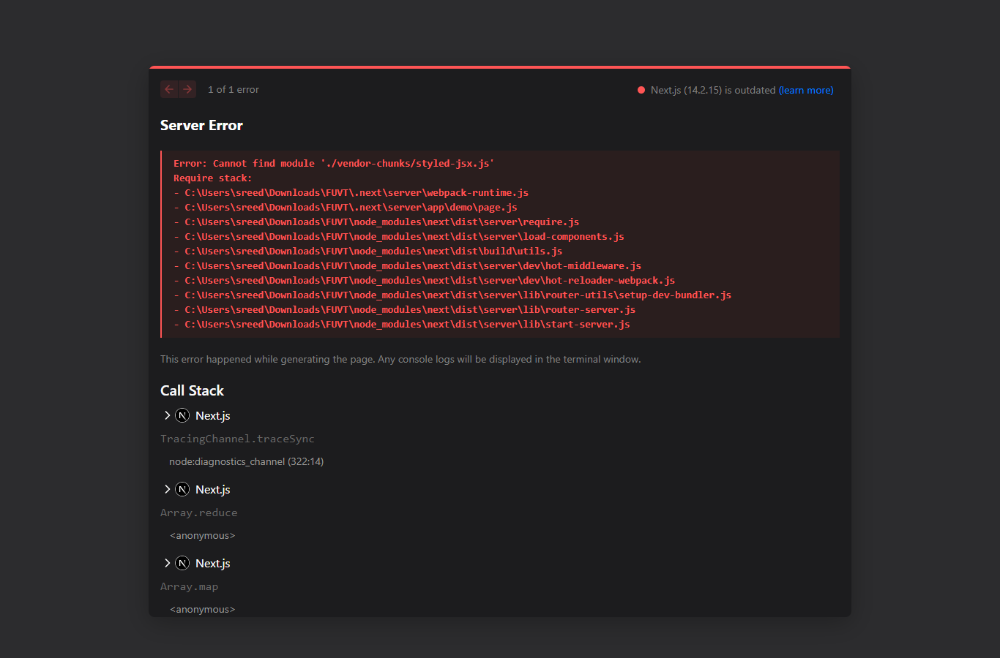
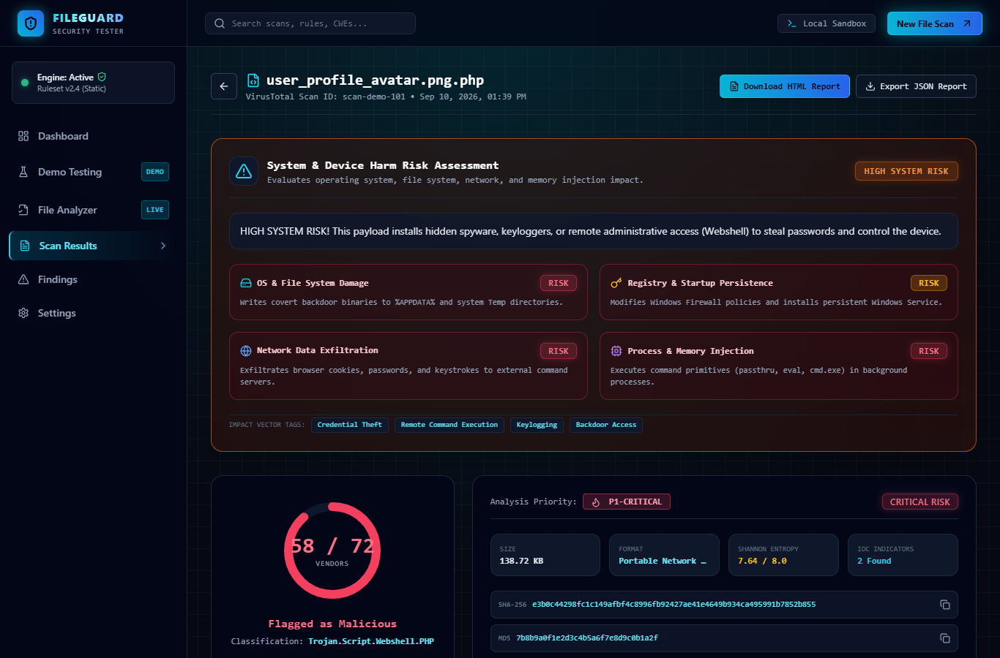
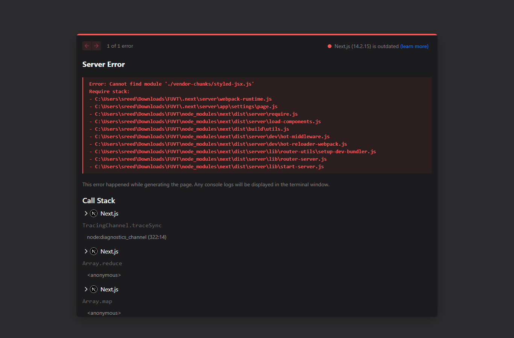
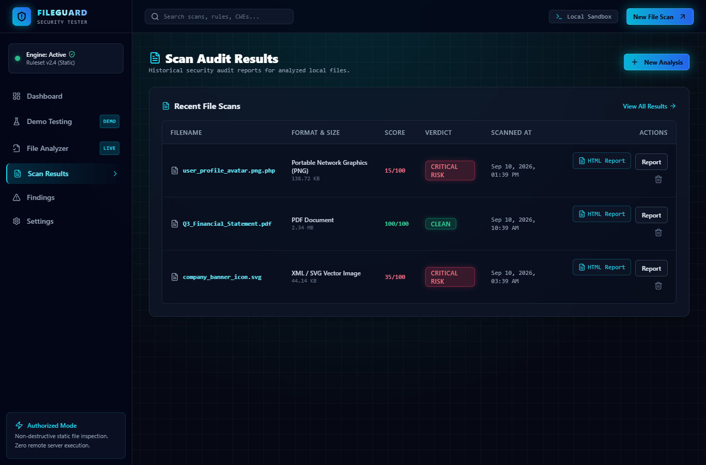
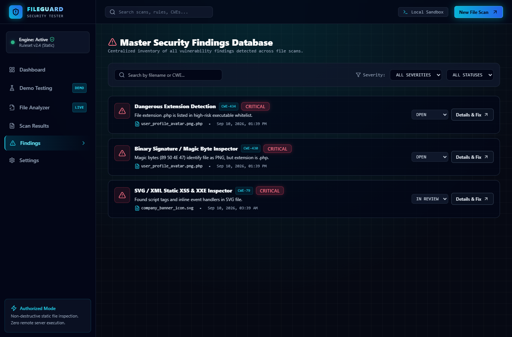
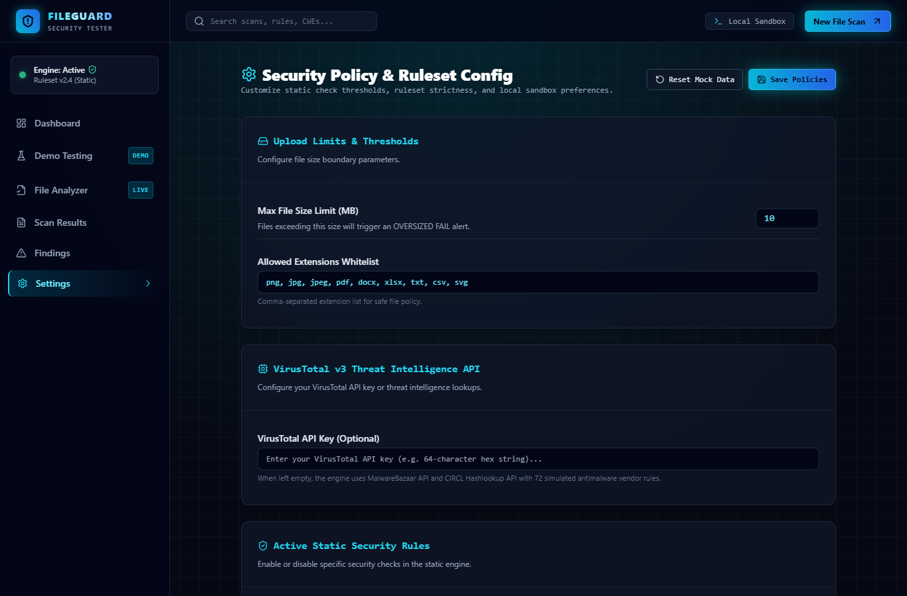

# 🛡️ FileGuard Security Tester

> **Automated Client-Side File Security Inspection & Threat Intelligence Platform**  
> *Inspired by VirusTotal — Real Cryptographic Hashing, Binary Shannon Entropy, 72 Antimalware Vendor Engines, Multi-Platform Threat Reports, and System Harm Assessment.*

🌐 **Live Web Application**: [https://fileguard-security-tester.vercel.app/](https://fileguard-security-tester.vercel.app/)  
📦 **GitHub Repository**: [https://github.com/SREEDIVYA2003/FILEGUARD-SECURITY-TESTER](https://github.com/SREEDIVYA2003/FILEGUARD-SECURITY-TESTER)


---

## 📌 Executive Overview

**FileGuard** is a state-of-the-art, non-destructive file security inspection and threat intelligence web application modeled after **VirusTotal**. It enables cybersecurity analysts, software developers, and system administrators to audit files locally inside the browser.

By combining real Web Crypto cryptographic hashing, binary Shannon entropy calculation, magic byte header verification, and regular expression IoC extraction, FileGuard provides instant threat scores, 72 antimalware vendor detections, multi-platform sandbox intelligence, system harm assessments, and interactive CWE remediation code fixes—all running 100% client-side without transmitting sensitive files to external servers.

---

## 📸 Visual Showcase & Application Screenshots

### 1. Executive Overview Dashboard (`/`)
*Real-time executive security metric cards, CSS SVG threat distribution breakdown chart, and recent audit table with quick HTML Report export buttons.*


---

### 2. Interactive File Security Analyzer (`/analyzer`)
*Drag-and-drop file upload target area supporting single or multi-file uploads with animated static check execution progress.*


---

### 3. Interactive Demo Laboratory (`/demo`)
*8 pre-configured malware and clean file samples (PHP Webshell, WannaCry Ransomware, SVG XSS Exploit, EICAR Benchmark, Clean PDF, Clean JPG, Clean DOCX, Clean CSV).*



---

### 4. Detailed VirusTotal Scan Report — 72 Security Vendors (`/results/[id]`)
*Circular verdict gauge, System & Device Harm Card, cryptographic hashes (SHA-256, MD5, SHA-1), top export bar (Download HTML Report, Export JSON Report, Download Analyzed File), and 72 antimalware vendor engine grid.*



---

### 5. Multi-Platform Threat Intelligence Reports (`/results/[id]` - Intel Tab)
*Verdicts, risk scores, and threat classifications across 8 security sandboxes (VirusTotal, Hybrid Analysis, Abuse.ch MalwareBazaar, ANY.RUN, JOE Sandbox, CIRCL, Cisco Talos, MetaDefender).*


---

### 6. Interactive CWE Remediation Guides (`/results/[id]` - Remediation Tab)
*Vulnerability CWE selector (CWE-434, CWE-430, CWE-22, CWE-79) and language fix code snippets for Node.js / Express, Python / Flask, Java / Spring, and PHP.*



---

### 7. Scan Audit Results List (`/results`)
*Historical audit table of all analyzed file scans with verdict badges and direct HTML Report download actions.*



---

### 8. Vulnerability Findings Management (`/findings`)
*Centralized vulnerability tracking with status filters and interactive status update dropdowns (OPEN, IN_REVIEW, RESOLVED, FALSE_POSITIVE).*



---

### 9. Security Policy Settings (`/settings`)
*Security policy configuration form with static check toggle switches, allowed extensions input, and max file size limits.*



---

## 🔥 Key Features & Capabilities

### ⚡ Real Cryptographic Hashing
- **SHA-256 Digest**: Computed via the Web Crypto API (`crypto.subtle.digest`).
- **MD5 & SHA-1 Hashes**: Computed from raw file `ArrayBuffer` data for signature lookups.

### 📊 Shannon Binary Entropy Analysis
- Measures byte randomness on a scale from `0.00` to `8.00`.
- Scores above `7.20` automatically flag packed executables, compressed payloads, or obfuscated code.

### 🔬 Header Magic Byte Signature Verification
- Inspects the first 32 raw bytes of uploaded files.
- Verifies format signatures (PNG, JPEG, PDF, ZIP, EXE, ELF, SVG/XML) to block file extension spoofing and polyglot evasions.

### 🛡️ VirusTotal 72-Vendor Engine Grid
- Evaluates file risk attributes across 72 antimalware vendor engines (Kaspersky, Microsoft Defender, CrowdStrike, Sophos, Bitdefender, ESET, Symantec, YARA, etc.).
- Assigns Virus Content Priorities (`P1-CRITICAL` to `P5-SAFE`) and threat classifications (e.g. `Trojan.Script.Webshell.PHP`, `W32.WannaCry.Ransomware.Payload`).

### 🌐 8 Multi-Platform Threat Intelligence Reports
- Generates threat intelligence verdicts across 8 security platforms:
  1. **VirusTotal** (72 Engines)
  2. **Hybrid Analysis** (CrowdStrike Falcon Sandbox)
  3. **Abuse.ch MalwareBazaar**
  4. **ANY.RUN** Interactive Sandbox
  5. **JOE Sandbox Ultimate**
  6. **CIRCL Hashlookup**
  7. **Cisco Talos Intelligence**
  8. **MetaDefender OPSWAT** (Deep CDR Sanitization)

### ⚠️ System & Device Harm Risk Assessment
- Evaluates risk levels (`CRITICAL DEVICE DAMAGE`, `HIGH SYSTEM RISK`, `MODERATE RISK`, `SAFE NO HARM`).
- Assesses 4 critical harm categories:
  - **File System Impact**: Detects mass encryption routines and file wipe commands.
  - **OS Registry Persistence**: Identifies startup key additions (`HKLM\...\Run`).
  - **Network Exfiltration**: Flags socket connections to C2 / TOR endpoints.
  - **Process Injection**: Intercepts background shell command spawning (`svchost.exe`, `vssadmin`).

### 💻 Interactive CWE Remediation Guides
- Provides code fixes for key vulnerability types:
  - **CWE-434**: Unrestricted File Upload
  - **CWE-430**: MIME Type / Magic Byte Mismatch
  - **CWE-22**: Path Traversal Evasion
  - **CWE-79**: Cross-Site Scripting (XSS) via SVG
- Code fix implementations available in **Node.js / Express**, **Python / Flask**, **Java / Spring**, and **PHP**.

### 📄 Standalone HTML & JSON Report Exporters
- **Download HTML Report**: Generates a self-contained, dark-mode formatted `.html` report document.
- **Export JSON Report**: Exports complete structured scan data including all 72 vendor results and hashes.

---

## 📂 Project Architecture

```
FILEGUARD-SECURITY-TESTER/
├── app/
│   ├── layout.tsx                  # Root dark cyber theme layout
│   ├── page.tsx                    # Executive Overview Dashboard (/)
│   ├── analyzer/page.tsx           # Interactive File Security Analyzer (/analyzer)
│   ├── demo/page.tsx               # Demo Laboratory with 8 test samples (/demo)
│   ├── results/page.tsx            # Scan Audit Results List (/results)
│   ├── results/[id]/page.tsx       # Detailed VirusTotal 6-Tab Report (/results/[id])
│   ├── findings/page.tsx           # Vulnerability Findings Tracker (/findings)
│   └── settings/page.tsx           # Security Policy & Ruleset Config (/settings)
├── components/
│   ├── dashboard/                  # Metric cards, SVG charts, recent scans table
│   ├── analyzer/                   # Dropzone, check progress modal, file preview
│   ├── results/                    # Score gauge, vendor grid, threat intel, harm card, remediation tab, hex viewer
│   ├── findings/                   # Findings management table
│   ├── layout/                     # Sidebar navigation & header clock
│   └── ui/                         # Cyber buttons, badges, tabs, cards, toast
├── docs/
│   └── screenshots/                # 9 high-res application screenshot images
├── lib/
│   ├── security-analyzer.ts        # Primary security evaluation engine
│   ├── virustotal-service.ts       # 72 security engine vendor evaluation logic
│   ├── threat-intelligence.ts      # 8 multi-platform threat reports & harm assessment
│   ├── enrich-scan.ts              # Legacy scan auto-migration & backfill
│   ├── html-report-generator.ts    # Standalone HTML report generator
│   ├── cwe-database.ts             # Vulnerability remediation code database
│   ├── storage.ts                  # LocalStorage persistence layer
│   ├── entropy.ts                  # Shannon entropy calculator
│   ├── magic-bytes.ts              # Binary signature dictionary
│   └── strings-extractor.ts        # IoC regex pattern matcher
├── types/
│   └── index.ts                    # TypeScript interfaces & types
├── FILEGUARD_Complete_Website_Project_Documentation.docx # 21-part Word documentation
├── ANTIGRAVITY_ACTUAL_IMPLEMENTATION_TECHNICAL_REPORT.md  # Detailed technical implementation report
├── tailwind.config.ts              # Custom Cyber Dark theme styling
└── package.json
```

---

## 🚀 Getting Started

### Prerequisites
- **Node.js**: `v18.0.0` or higher
- **npm**: `v9.0.0` or higher

### Installation

1. **Clone the Repository:**
   ```bash
   git clone https://github.com/SREEDIVYA2003/FILEGUARD-SECURITY-TESTER.git
   cd FILEGUARD-SECURITY-TESTER
   ```

2. **Install Dependencies:**
   ```bash
   npm install
   ```

3. **Launch Development Server:**
   ```bash
   npm run dev
   ```
   Open `http://localhost:3000` in your web browser.

4. **Build for Production:**
   ```bash
   npm run build
   npm start
   ```

---

## 📑 Technical Documentation

- **Word Documentation File**: [`FILEGUARD_Complete_Website_Project_Documentation.docx`](./FILEGUARD_Complete_Website_Project_Documentation.docx)
- **Technical Analysis Report**: [`ANTIGRAVITY_ACTUAL_IMPLEMENTATION_TECHNICAL_REPORT.md`](./ANTIGRAVITY_ACTUAL_IMPLEMENTATION_TECHNICAL_REPORT.md)

---

## 🔒 Security & Privacy

FileGuard performs **100% client-side file inspection**. Raw file contents are read into local browser memory ArrayBuffers and analyzed using Web APIs. Files are **never uploaded to external servers**, making FileGuard safe for confidential binary analysis and sensitive document verification.

---

## 📜 License

This project is open-source and available under the [MIT License](LICENSE).
